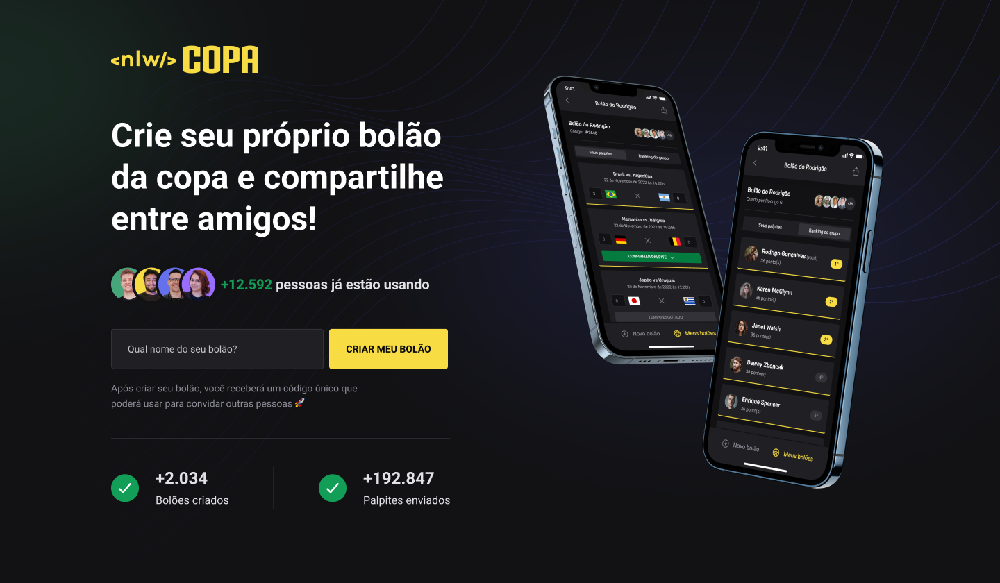
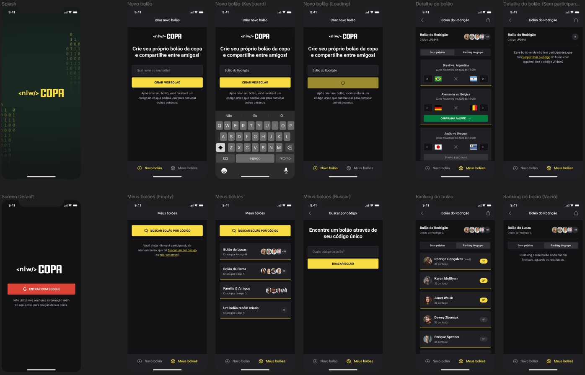

<h1 align="center">NLW Copa</h1>

    <a href="#-Introducao">Introdução</a>&nbsp;&nbsp;&nbsp;|&nbsp;&nbsp;&nbsp;
  <a href="#-Funcionalidades">Funcionalidades</a>&nbsp;&nbsp;&nbsp;|&nbsp;&nbsp;&nbsp;
  <a href="#-tecnologias-utilizadas">Tecnologias</a>&nbsp;&nbsp;&nbsp;|&nbsp;&nbsp;&nbsp;
  <a href="#-projetoWeb">Projeto web</a>&nbsp;&nbsp;&nbsp;|&nbsp;&nbsp;&nbsp;
  <a href="#-projetoMobile">Projeto mobile</a>&nbsp;&nbsp;&nbsp;

 

  

---

 

## 📝 Introdução

    O projeto NLW Copa é uma aplicação web e mobile que permite aos usuários criarem e participarem de bolões com os resultados dos jogos da Copa do Mundo. Através do backend desenvolvido com o auxílio do Prisma, construí uma API Restful onde os usuários podem criar e gerenciar seus bolões, cadastrar usuários, criar grupos e convidar outros usuários para participar. O sistema web, desenvolvido em React com auxílio do Next.js, permite aos usuários gerenciarem seus bolões através de uma interface intuitiva e responsiva, além de visualizarem as informações dos jogos e os resultados dos bolões em tempo real.

    Já o aplicativo mobile, desenvolvido em React Native com o framework Expo, oferece aos usuários uma experiência nativa em iOS e Android para gerenciar seus bolões, visualizar as informações dos jogos e acompanhar os resultados dos bolões em tempo real. Além disso, o aplicativo também permite que os usuários recebam notificações push sobre os resultados dos jogos e dos bolões.

    Com a combinação dessas tecnologias, o projeto oferece uma solução completa e integrada para os usuários que desejam criar e participar de bolões da Copa do Mundo, seja através do sistema web ou do aplicativo mobile. A integração entre as tecnologias utilizadas também oferece uma maior flexibilidade para o desenvolvimento e manutenção da aplicação, garantindo uma experiência fluida e eficiente para os usuários.

 

---

 

## 📖 Funcionalidades

- Criação de bolões (Web e Mobile)
- Visualização de bolões criados, palpites enviados e informações relevantes
- Autenticação utilizando o oAuth2 do Google para fazer login
- Busca de bolões por códigos únicos que são gerados automaticamente
- Realização de palpites nos jogos
- Após compartilhar o código e pessoas entrarem no seu jogo, é possível ver o ranking de quem está ganhando

 

---

 

## 🚀 Tecnologias utilizadas

Esse projeto foi desenvolvido com as seguintes tecnologias:

- JavaScript
- TypeScript
- Node
- React
- React Native
- Expo
- Next.js
- Fastify
- Prisma
- Tailwind
- Git e Github

 

---

 

## 💻 Projeto Web

 

  

 

---

 

## 💻 Projeto Mobile

 

  

 
